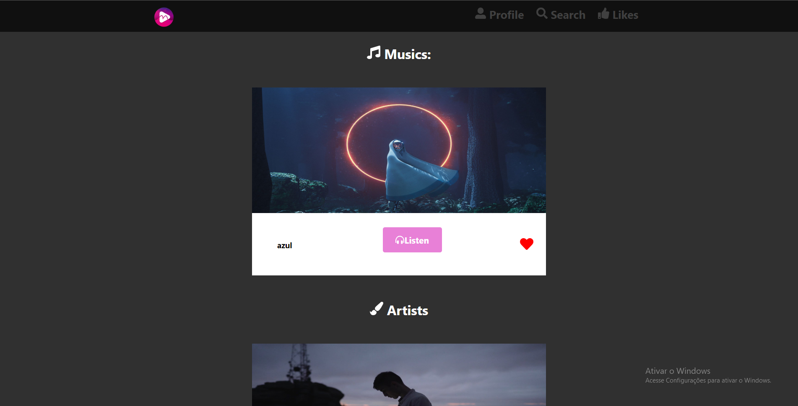
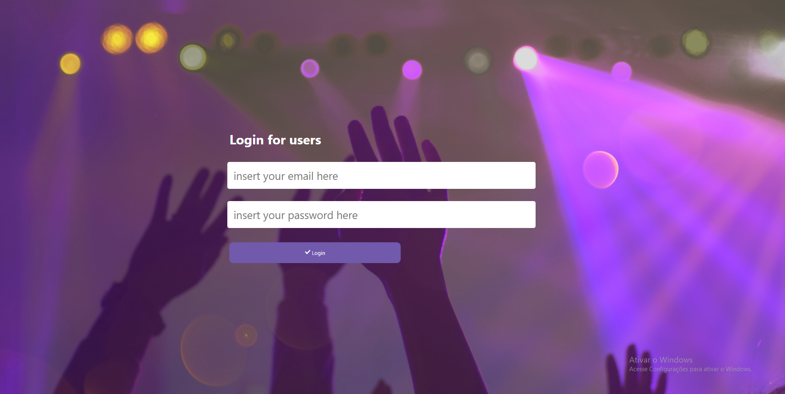

	

<h1 align="center">OpenMusicJS</h1>

	This Readme was write in portuguese, if you want a english version <a href="https://github.com/GustavoSMelo/OpenMusicJS/blob/master/README.md#Run-this-project">click here</a>
	 
	(Este "Leia me" foi escrito em portugues, se quiser a versao em ingles <a href="https://github.com/GustavoSMelo/OpenMusicJS/blob/master/README.md#Run-this-project">click aqui</a>)
	 
	Um aplicativo open source para nossos usuarios escutarem musicas gratuitamente e artistas desconhecidos postarem suas criaçoes

	
	
	

# :ship: Menu de navegação

- [Web Application Screenshots](#globe_with_meridians-Web-Application-Screenshots)
- [Android App Light](#iphone-Android-App-Light)
- [Android App Dark](#iphone-Android-App-Dark)
- [Run this project](#Run-this-project)
- [About me](#bust_in_silhouette-About-me)

# Website responsivo e animado

# :globe_with_meridians: Screenshots do aplicativo web

	
	
	
	
	
	
	
	

# :iphone: Android App Claro

	 &nbsp;&nbsp;&nbsp;  &nbsp;&nbsp;&nbsp; 
	 
	 &nbsp;&nbsp;&nbsp;  &nbsp;&nbsp;&nbsp; 

# :iphone: Android App Escuro

	 &nbsp;&nbsp;&nbsp;  &nbsp;&nbsp;&nbsp; 
	 
	 &nbsp;&nbsp;&nbsp;  &nbsp;&nbsp;&nbsp; 

<h2>Tecnologias utilizadas nesse projeto: </h2>

| Backend | Frontend | Mobile       | Database |
| ------- | -------- | ------------ | -------- |
| NodeJS  | ReactJS  | React Native | Postgres |

## Para rodar este projeto

### :clipboard: Coisas que você precisa:

- SGBD (Eu estou utilizando postgres)
- Node.JS
- Yarn (recomendado mas não é necessario)
- Expo
- Emulador Mobile (or celular fisico)

### :file_folder: Backend

- Abre a pasta `backend` no seu terminal.
- Rode no seu console: `yarn` (no caso de você utilizar yar) ou `npm install`.
- Crie dentro da pasta `backend` crie uma pasta fora do `src` chamada: "tmp".
- dentro da pasta `tmp`, crie outra pasta chamada `uploads` e dentro dela crie outras duas pastas com nome de: `img` e `music`.
- Crie um banco de dados chamado: "OpenMusicJS".
- rode no seu console: `yarn (or npx) sequelize db:migrate`.
- depois disso, dentro do `backend` (no terminal) rode: `yarn start`.

### :computer: Frontend

- Primeiramente, rode as etapas do backend
- dps disso você vai precisar rodar `yarn` ou `npm install` dentro do seu console (dentro da pasta `frontend`) e por fim, rode `yarn start` ou `npm start`.

### :iphone: Mobile (with Android emulator)

- Primeiramente, rode as etapas do backend
- abra seu emulador (de preferencia android)
- Baixe o aplicativo do expo no seu emulador
- Abra a pasta mobile dentro do seu terminal
- rode `yarn` ou `npm install`.
- depois disso, rode `expo start` e aguarde até a aplicação carregar
- Quando a aplicação carregar, abra seu terminal e clique na tecla "A"

### :iphone: Mobile (with physical cellphone)

- Primeiramente, rode as etapas do backend
- Baixe o aplicativo do expo no seu celular
- abra o aplicativo do expo
- Abra o mobile dentro do seu terminal
- rode `yarn` ou `npm install`.
- depois disso, execute `expo start` e aguarde até a aplicação carregar.
- Quando a aplicação carregar, scannei o QR CODE

## :bust_in_silhouette: About me

    Eu sou um simples desenvolvedor que é apaixonado em estudar e jogar video games.
    Caso queira entrar em contato comigo, email e linkedin abaixo

    Email: gsantos15569@gmail.com
    Linkedin: https://www.linkedin.com/in/gustavo-santos-melo-66092317a/

## Make with Love :heartbeat: Gustavo S. Melo
