

	

<h1 align="center">OpenMusicJS</h1>

	This Readme was write in english, if you want a portuguese version <a href="/">click here</a>
	 
	(Este "Leia me" foi escrito em ingles, se quiser a versao em portugues <a href="/">click aqui</a>)
	 
	App open source to users listen musics for free and artists unknow post yours creations

	
	
	

# :ship: Navigation menu

- [Web Application Screenshots](#globe_with_meridians-Web-Application-Screenshots)
- [Android App Light](#iphone-Android-App-Light)
- [Android App Dark](#iphone-Android-App-Dark)
- [Run this project](#Run-this-project)
- [About me](#bust_in_silhouette-About-me)

# Website responsive and animations

# :globe_with_meridians: Web Application Screenshots

	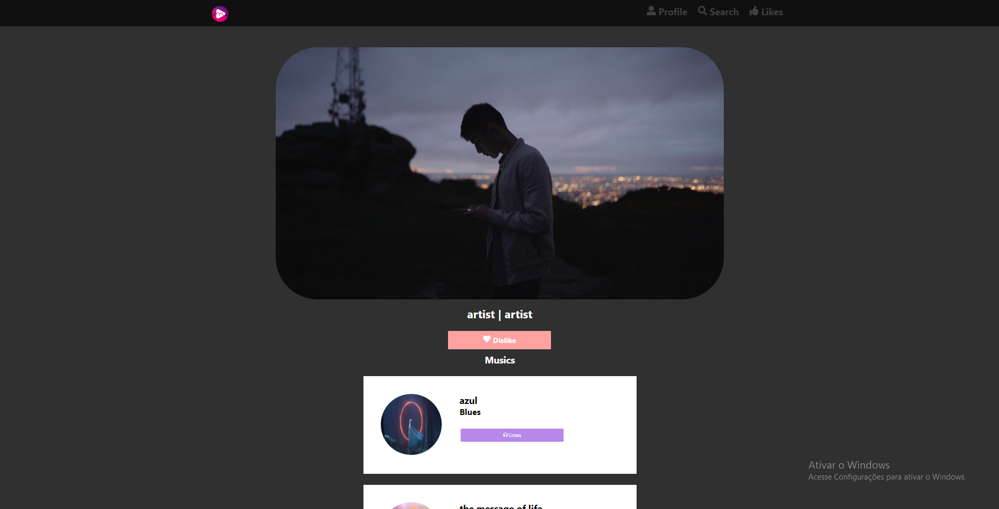
	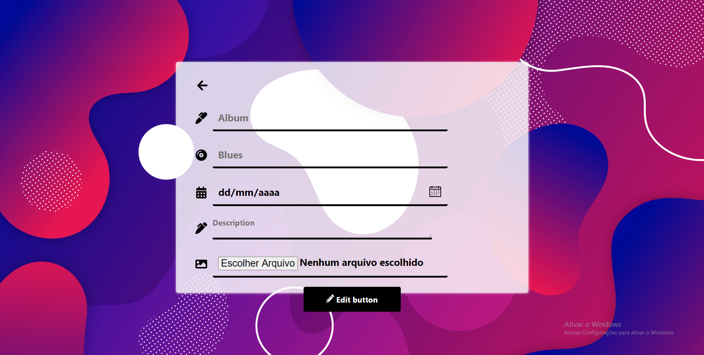
	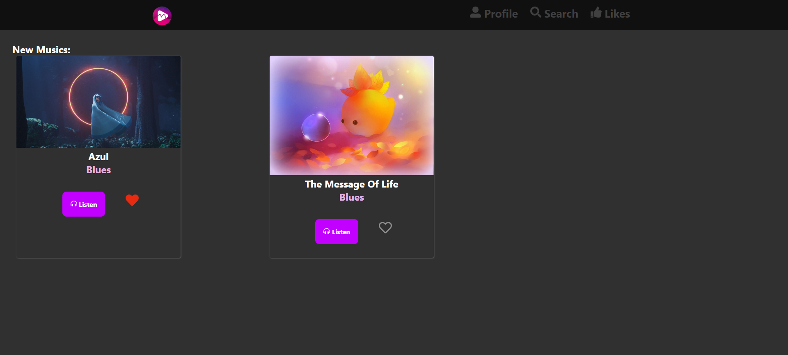
	
	
	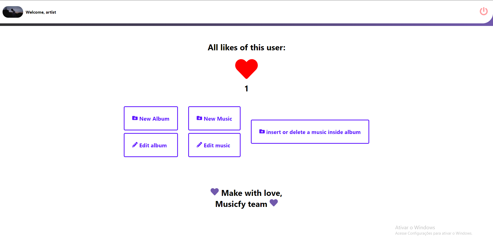
	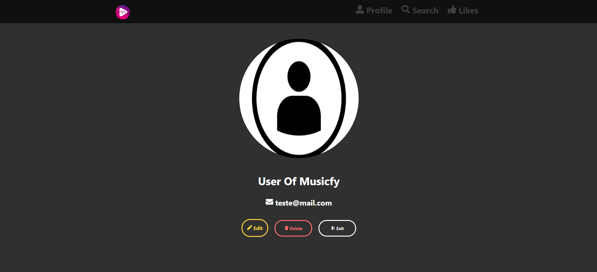
	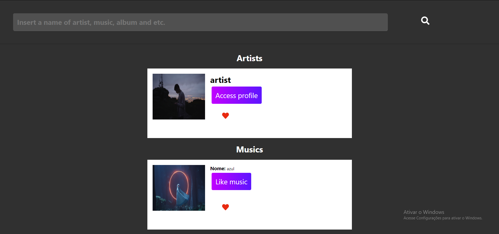

# :iphone: Android App Light

	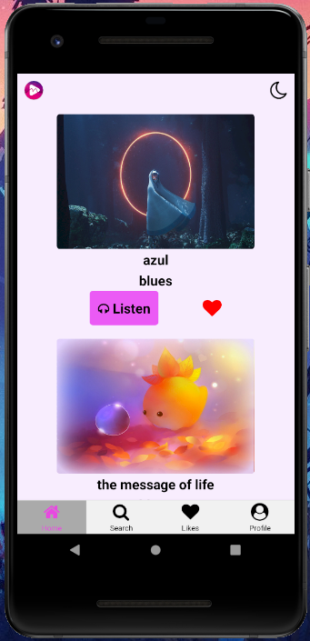 &nbsp;&nbsp;&nbsp; 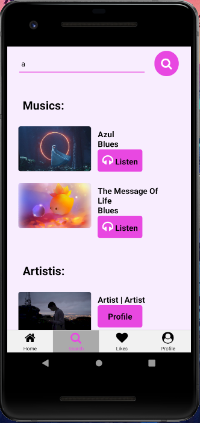 &nbsp;&nbsp;&nbsp; 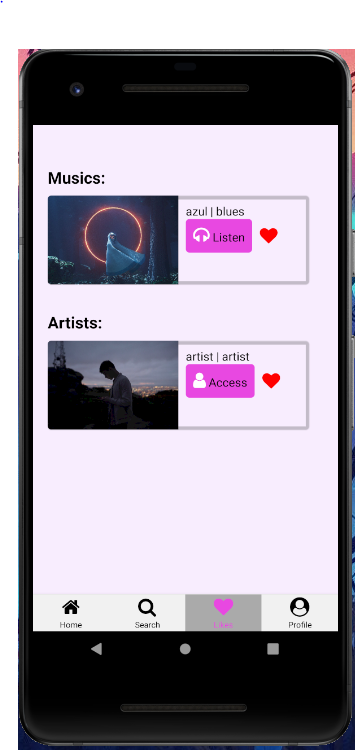
	 
	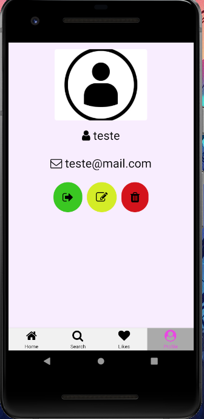 &nbsp;&nbsp;&nbsp; 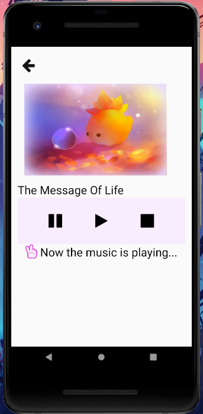 &nbsp;&nbsp;&nbsp; 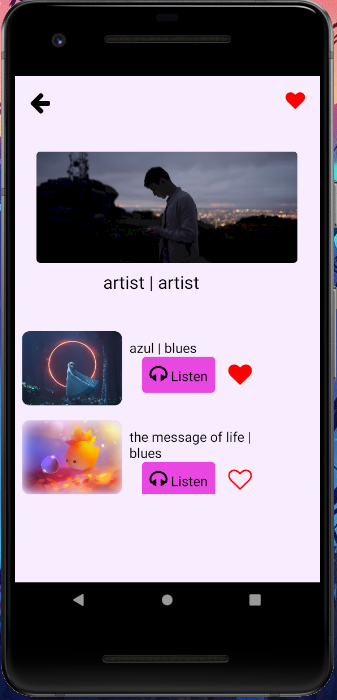

# :iphone: Android App Dark

	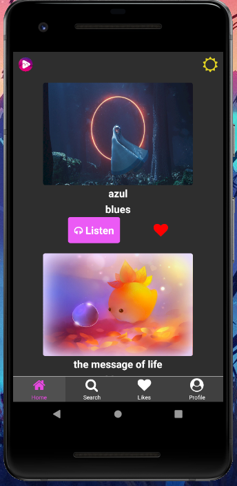 &nbsp;&nbsp;&nbsp; 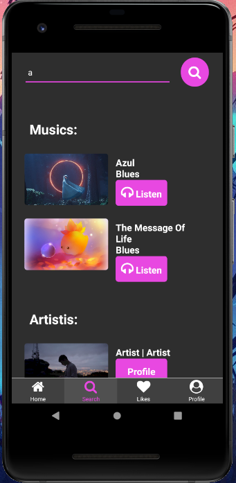 &nbsp;&nbsp;&nbsp; 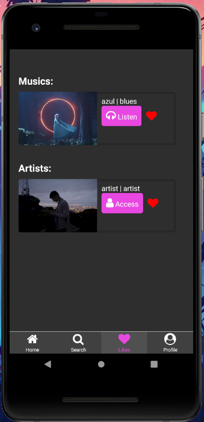
	 
	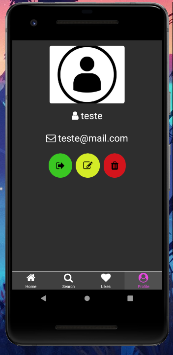 &nbsp;&nbsp;&nbsp; 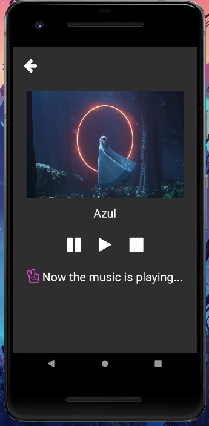 &nbsp;&nbsp;&nbsp; 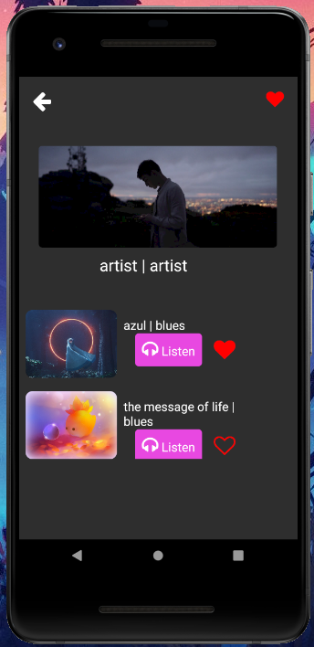

<h2>Tecnologies useds in this project: </h2>

| Backend | Frontend | Mobile       | Database |
| ------- | -------- | ------------ | -------- |
| NodeJS  | ReactJS  | React Native | Postgres |

## Run this project

### :clipboard: Things that you need:

- SGBD (I'm using postgres)
- Node.JS
- Yarn (recommend, but not necessary)
- Expo
- Mobile Emulator (or physical cellphone)

### :file_folder: Backend

- Open the `backend` folder in your terminal.
- Run in your console: `yarn` (in case you use yarn) or `npm install`.
- Create a new folder inside of the `backend` folder and outside the `src` folder called: "tmp".
- Inside of `tmp`, create a new folder called `uploads` and inside of this folder
  create another two folders: `img` and `music`.
- Create a database called "OpenMusicJS".
- Run in your console: `yarn (or npx) sequelize db:migrate`.
- After that, go to `backend` and run `yarn start`.

### :computer: Frontend

- Firstly, you need to do the backend step.
- After that, you need to run `yarn` or `npm install` in your console (inside the `frontend` folder) and run `yarn start` or `npm start`.

### :iphone: Mobile (with Android emulator)

- First, run the backend.
- Open your Android emulator.
- Open the mobile folder in the console.
- Run `yarn` or `npm install`.
- After that, run `expo start` and wait until the application opens.
- When the application opens, enter in the console and click 'A'.

### :iphone: Mobile (with physical cellphone)

- Download the Expo app in your cellphone.
- Enter the Expo app.
- Open the mobile folder in the console.
- Run `yarn` or `npm install`.
- After that, run `expo start` and wait until the application opens.
- When the application opens, scan the QR CODE with your cellphone.

## :bust_in_silhouette: About me

    I am a simple developer that love study and play video games
    if you want to enter in contact with me:

    Email: gsantos15569@gmail.com
    Linkedin: https://www.linkedin.com/in/gustavo-santos-melo-66092317a/

## Make with Love :heartbeat: Gustavo S. Melo
